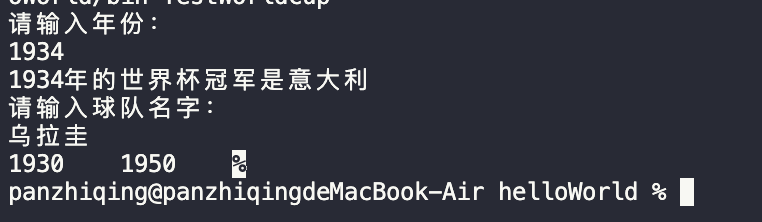

# 期末考试 编程题 答题卡
> 4.19 14:54:00
## 运行结果



## 1. `WorldCup`类

* 定义世界杯类WorldCup，该类包括序号id、举办年份year、举办国country、冠军队team四个私有成员变量（已定义）。
* 在该类中定义有参构造方法和所有成员变量的set、get方法。

```java
class WorldCup {
    private int id;  //序号
    private int year;  //举办年份
    private String country;  //举办国
    private String team;    //冠军队

    //（1）此处定义有参构造方法。  
    WorldCup(int id,int year,String country,String team){
        this.id=id;
        this.year=year;
        this.country=country;
        this.team=team;
    }   
    //（2）此处定义所有成员变量的get和set方法。
    public int getId(){
        return id;
    }
    public void setId(int id){
        this.id=id;
    }
    public int getYear(){
        return year;
    }
    public void setYear(int year){
        this.year=year;
    }
    public String getCountry(){
        return country;
    }
    public void setCountry(String country){
        this.country=country;
    }
    public String getTeam(){
        return team;
    }
    public void setTeam(String team){
        this.team=team;
    }
}
```
## 2. `TestWorldCup`类
定义测试类TestWorldCup，利用Map集合，完成下面的功能（部分代码已给出）：
* 1、输入一个年份，输出该年的世界杯冠军是哪支球队。如果该年没有举办世界杯，则输出：“该年没有举办世界杯”。
* 2、输入一支球队的名字，输出该球队夺冠的年份列表。 如果该球队未夺过冠，则输出“该队未曾获得过冠军” 
> `例如`：
    ```
    巴西
    1958 1962 1970 1994 2002 
    荷兰
    该队未曾获得过冠军
    ```
        
```java
    public static void main(String[] args) {    
        // ...    
        //（3）此处输入年份，根据年份查找该年的冠军队，如果该年没举办世界杯就输出“该年没举办世界杯”。
        // read year
        Scanner sc=new Scanner(System.in);
        System.out.println("请输入年份：");
        int year=sc.nextInt();
        if(m.containsKey(year)){
            System.out.println(year+"年的世界杯冠军是"+m.get(year).getTeam());
        }else{
            System.out.println("该年没有举办世界杯");
        }
        //（4）此处输入一支球队的名字，输出该球队夺冠的年份列表。 如果该球队未夺过冠，则输出“该队未曾获得过冠军”。

        System.out.println("请输入球队名字：");
        String team=sc.next();
        boolean flag=false;
        for(WorldCup wc:m.values()){
            if(wc.getTeam().equals(team)){
                System.out.print(wc.getYear()+"\t");
                flag=true;
            }
        }
        if(!flag){
            System.out.println("该队未曾获得过冠军");
        }
        sc.close();
    }
```