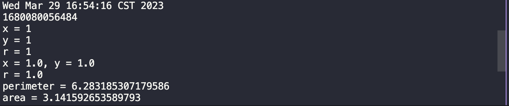
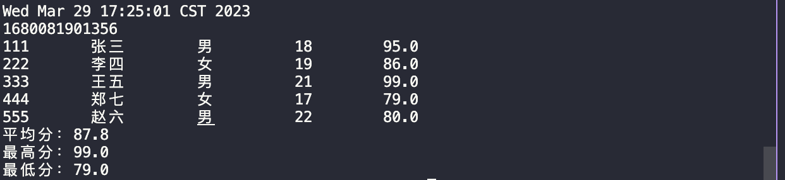
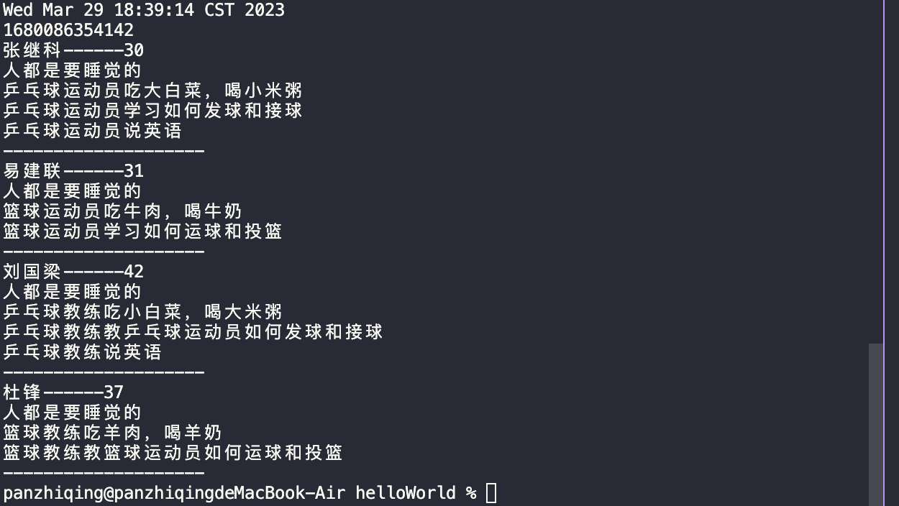

# JAVA 作业二实验报告
> null 

> Report time: 验证运行时间
>```java
>long millis = System.currentTimeMillis();
>System.out.println(millis);
>// convert millis to date time
>java.util.Date date = new java.util.Date(millis);
>System.out.println(date);
>// convert date time to millis
>long millis2 = date.getTime();
>System.out.println(millis2);
>```
>打印程序运行的时间


## 1.题目一

`结果`:



### 设计一个父类Point类

`要求`:
- 定义两个私有属性表示一个点的坐标值；
- 定义两个参数的构造方法；
- 定义一个无参print方法打印当前点的坐标。

`code`:
```java
public class Point {
    private double x;
    private double y;

    public Point(double x, double y) {
        this.x = x;
        this.y = y;
    }

    public void print() {
        System.out.println("x = " + x + ", y = " + y);
    }
}
```

### 设计一个子类Circle类继承自Point类

`要求`:
- 定义私有属性圆半径；
- 定义三个参数的构造方法；
- 定义一个方法perimeter计算圆周长；
- 定义一个方法area求圆面积; 
- 重写父类的print方法打印圆的圆心坐标和半径，其中圆心坐标的输出调用父类的print方法。

`code`:
```java
public class Circle extends Point {
    private double r;

    public Circle(double x, double y, double r) {
        super(x, y);
        this.r = r;
    }

    public double perimeter() {
        return 2 * Math.PI * r;
    }

    public double area() {
        return Math.PI * r * r;
    }

    @Override
    public void print() {
        super.print();
        System.out.println("r = " + r);
    }
}
```


### 设计一个圆柱体类Cylinder继承自Circle类

`要求`:
- 增加私有属性:高度h
- 定义四个参数的构造方法
- 重写父类的area方法计算表面积，其中底面积调用父类的area方法，底的周长调用父类的circumference方法
- 定义计算体积的方法volume，其中底面积调用父类的area方法
- 重写父类的print方法打印圆柱体的底面圆心坐标、半径和高

`code`:
```java
public class Cylinder extends Circle {
    private double h;

    public Cylinder(double x, double y, double r, double h) {
        super(x, y, r);
        this.h = h;
    }

    @Override
    public double area() {
        return 2 * super.area() + super.perimeter() * h;
    }

    public double volume() {
        return super.area() * h;
    }

    @Override
    public void print() {
        super.print();
        System.out.println("h = " + h);
    }
}
```

### 定义一个主类
#### 创建一个Circle对象

`要求`:
- 从键盘输入圆心坐标和半径
- 然后输出:
- * 圆心坐标
- * 半径
- * 周长
- * 面积
> 圆心坐标和半径要求通过调用print方法输出。

`code`:
```java
public class Main {
    public static void main(String[] args) {
        Scanner scanner = new Scanner(System.in);
        System.out.print("x = ");
        double x = scanner.nextDouble();
        System.out.print("y = ");
        double y = scanner.nextDouble();
        System.out.print("r = ");
        double r = scanner.nextDouble();
        Circle circle = new Circle(x, y, r);
        circle.print();
        System.out.println("perimeter = " + circle.perimeter());
        System.out.println("area = " + circle.area());
    }
}
```

#### 创建一个Cylinder类对象

`要求`:
- 从键盘输入底面圆心坐标、半径和高
- 然后输出表面积和体积

`code`:
```java
public class Main {
    public static void main(String[] args) {
        Scanner scanner = new Scanner(System.in);
        System.out.print("x = ");
        double x = scanner.nextDouble();
        System.out.print("y = ");
        double y = scanner.nextDouble();
        System.out.print("r = ");
        double r = scanner.nextDouble();
        System.out.print("h = ");
        double h = scanner.nextDouble();
        Cylinder cylinder = new Cylinder(x, y, r, h);
        System.out.println("area = " + cylinder.area());
        System.out.println("volume = " + cylinder.volume());
    }
}
```

## 2.设计一个表示学生信息的类Student
### `结果`:



`要求`: 

- 类`Student`的成员变量（定义成私有的）:
  - * sno表示学号
  - * sname表示姓名
  - * ssex表示性别
  - * sage表示年龄
  - * sjava表示Java课的成绩

- 类`Student`带参数的构造方法
  - * 在构造方法中通过形参完成对成员变量的赋值操作
- 类`Student`的方法成员:

  - * `getSno()`   :  获得学号
  - * `getSname()` :  获得姓名
  - * `getSsex()`  :  获得性别
  - * `getSage()`  :  获得年龄
  - * `getSjava()` :  获得Java课程成绩

`code`:

```java
public class Student {
    private String sno;
    private String sname;
    private String ssex;
    private int sage;
    private double sjava;

    public Student(String sno, String sname, String ssex, int sage, double sjava) {
        this.sno = sno;
        this.sname = sname;
        this.ssex = ssex;
        this.sage = sage;
        this.sjava = sjava;
    }

    public String getSno() {
        return sno;
    }

    public String getSname() {
        return sname;
    }

    public String getSsex() {
        return ssex;
    }

    public int getSage() {
        return sage;
    }

    public double getSjava() {
        return sjava;
    }
}
```
`要求`:

- 定义主类，创建包含5个Student类对象的数组，使用循环输出这5个学生的信息，
- 并计算Java课成绩的平均分，以及Java课成绩的最高分和最低分。
要求运行结果按下列示例的格式对齐输出: 

`code`:
```java
public class Main {
    public static void main(String[] args) {
        Student[] students = new Student[5];
        students[0] = new Student("111", "张三", "男", 18, 95);
        students[1] = new Student("222", "李四", "女", 19, 86);
        students[2] = new Student("333", "王五", "男", 21, 99);
        students[3] = new Student("444", "郑七", "女", 17, 79);
        students[4] = new Student("555", "赵六", "男", 22, 80);
        double sum = 0;
        double max = students[0].getSjava();
        double min = students[0].getSjava();
        for (Student student : students) {
            System.out.printf("%-10s%-10s%-10s%-10s%-10s\n", student.getSno(), student.getSname(), student.getSsex(), student.getSage(), student.getSjava());
            sum += student.getSjava();
            if (student.getSjava() > max) {
                max = student.getSjava();
            }
            if (student.getSjava() < min) {
                min = student.getSjava();
            }
        }
        System.out.println("平均分:" + sum / students.length);
        System.out.println("最高分:" + max);
        System.out.println("最低分:" + min);
    }
}
```

## 3.设计下图所示的接口、抽象类、具体类并进行测试



### `要求`:

- 定义抽象类 `Person` ，包含如下成员变量和方法：
  - * 成员变量：姓名、年龄
  - * 抽象方法：`public abstract void eat();`
  - * 抽象方法：`public abstract void sleep();`
- `code`:
```java
abstract class Person {
    private String name;
    private int age;

    public Person(String name, int age) {
        this.name = name;
        this.age = age;
    }

    public abstract void eat();

    public abstract void sleep();

    public void info() {
        System.out.println(name + "------" + age);
    }

    public void printSlash(){
        System.out.println("--------------------");
    }
}
```

- 定义接口 `StudyEnglish` ，包含如下方法：
  - * 抽象方法：`public abstract void oralEnglish();`
- `code`:
```java
interface StudyEnglish {
    void oralEnglish();
}
```

- 定义抽象类 `Player` ，继承抽象类 `Person` ，包含如下成员方法：
    - * 抽象方法 `exercise` ： `public abstract void exercise();`
- `code`:
```java
abstract class Player extends Person {
    public Player(String name, int age) {
        super(name, age);
    }

    public abstract void exercise();
}
```

- 定义抽象类教练 `trainer` ，继承抽象类 `Person` ，包含如下成员方法：
    - * 抽象方法 `teach` ： `public abstract void teach();`
- `code`:
```java
abstract class Trainer extends Person {
    public Trainer(String name, int age) {
        super(name, age);
    }

    public abstract void teach();
}
```

- 定义具体类 `PingPongPayer` , 继承抽象类 `Player` ，实现接口 `StudyEnglish` ，包含如下成员方法：
    - * 重写抽象方法 `eat` ： `public void eat() { System.out.println("乒乓球运动员吃大白菜，喝小米粥"); }`
    - * 重写抽象方法 `sleep` ： `public void sleep() { System.out.println("人都是要睡觉的"); }`
    - * 重写抽象方法 `exercise` ： `public void exercise() { System.out.println("乒乓球运动员学习如何发球和接球"); }`
    - * 重写抽象方法 `oralEnglish` ： `public void oralEnglish() { System.out.println("乒乓球运动员说英语"); }`

`code`:
```java
class PingPongPayer extends Player implements StudyEnglish {
    public PingPongPayer(String name, int age) {
        super(name, age);
    }

    @Override
    public void eat() {
        System.out.println("乒乓球运动员吃大白菜，喝小米粥");
    }

    @Override
    public void sleep() {
        System.out.println("人都是要睡觉的");
    }

    @Override
    public void exercise() {
        System.out.println("乒乓球运动员学习如何发球和接球");
    }

    @Override
    public void oralEnglish() {
        System.out.println("乒乓球运动员说英语");
    }
}
```

- 定义具体类 `BasketballPayer` , 继承抽象类 `Player` ，包含如下成员方法：
    - * 重写抽象方法 `eat` ： `public void eat() { System.out.println("篮球运动员吃牛肉，喝牛奶 "); }`
    - * 重写抽象方法 `sleep` ： `public void sleep() { System.out.println("人都是要睡觉的 "); }`
    - * 重写抽象方法 `exercise` ： `public void exercise() { System.out.println("篮球运动员学习如何运球和投篮"); }`
- `code`:
```java
class BasketballPayer extends Player {
    public BasketballPayer(String name, int age) {
        super(name, age);
    }

    @Override
    public void eat() {
        System.out.println("篮球运动员吃牛肉，喝牛奶 ");
    }

    @Override
    public void sleep() {
        System.out.println("人都是要睡觉的 ");
    }

    @Override
    public void exercise() {
        System.out.println("篮球运动员学习如何运球和投篮");
    }
}
```

- 定义具体类 `PingPongTrainer` , 继承抽象类 `Trainer` ，实现接口 `StudyEnglish`，包含如下成员方法：
    - * 重写抽象方法 `eat` ： `public void eat() { System.out.println("乒乓球教练吃小白菜，喝大米粥"); }`
    - * 重写抽象方法 `sleep` ： `public void sleep() { System.out.println("人都是要睡觉的"); }`
    - * 重写抽象方法 `teach` ： `public void teach() { System.out.println("乒乓球教练教乒乓球运动员如何发球和接球"); }`
    - * 重写抽象方法 `oralEnglish` ： `public void oralEnglish() { System.out.println("乒乓球教练说英语"); }`

`code`:
```java
class PingPongTrainer extends Trainer implements StudyEnglish {
    public PingPongTrainer(String name, int age) {
        super(name, age);
    }

    @Override
    public void eat() {
        System.out.println("乒乓球教练吃小白菜，喝大米粥");
    }

    @Override
    public void sleep() {
        System.out.println("人都是要睡觉的");
    }

    @Override
    public void teach() {
        System.out.println("乒乓球教练教乒乓球运动员如何发球和接球");
    }

    @Override
    public void oralEnglish() {
        System.out.println("乒乓球教练说英语");
    }
}
```

- 定义具体类 `BasketballTrainer` , 继承抽象类 `Trainer` ，包含如下成员方法：
    - * 重写抽象方法 `eat` ： `public void eat() { System.out.println("篮球教练吃羊肉，喝羊奶"); }`
    - * 重写抽象方法 `sleep` ： `public void sleep() { System.out.println("人都是要睡觉的"); }`
    - * 重写抽象方法 `teach` ： `public void teach() { System.out.println("篮球教练教篮球运动员如何运球和投篮"); }`

`code`:
```java
class BasketballTrainer extends Trainer {
    public BasketballTrainer(String name, int age) {
        super(name, age);
    }

    @Override
    public void eat() {
        System.out.println("篮球教练吃羊肉，喝羊奶 ");
    }

    @Override
    public void sleep() {
        System.out.println("人都是要睡觉的 ");
    }

    @Override
    public void teach() {
        System.out.println("篮球教练教篮球运动员如何运球和投篮");
    }
}
```

- 测试
- * 测试输入：
```
张继科 
30 
易建联 
31 
刘国梁 
42 
杜锋 
37 
```

- * 预期输出： 

```
张继科---30 
人都是要睡觉的 
乒乓球运动员吃大白菜，喝小米粥 
乒乓球运动员学习如何发球和接球 
乒乓球运动员说英语 
---------------- 
易建联---31 
人都是要睡觉的 
篮球运动员吃牛肉，喝牛奶 
篮球运动员学习如何运球和投篮
---------------- 
刘国梁---42 
人都是要睡觉的 
乒乓球教练吃小白菜，喝大米粥 
乒乓球教练教如何发球和接球 
乒乓球教练说英语 
---------------- 
杜锋---37 
人都是要睡觉的 
篮球教练吃羊肉，喝羊奶  
篮球教练教如何运球和投篮 
----------------
```

- `code`:
```java
Person[] people = new Person[4];
people[0] = new PingPongPayer("张继科", 30);
people[1] = new BasketballPayer("易建联", 31);
people[2] = new PingPongTrainer("刘国梁", 42);
people[3] = new BasketballTrainer("杜锋", 37);

for (Person person : people) {
    person.info();
    person.sleep();
    person.eat();

    if (person instanceof Player) {
        ((Player) person).exercise();

        // if implemet interface StudyEnglish
        
        if (person instanceof StudyEnglish) {
            ((StudyEnglish) person).oralEnglish();;
        }

    }
    if (person instanceof Trainer) {
        ((Trainer) person).teach();

        // if implemet interface StudyEnglish
        if (person instanceof StudyEnglish) {
            ((StudyEnglish) person).oralEnglish();;
        }
    }

    // print slah
    person.printSlash();
}
```
